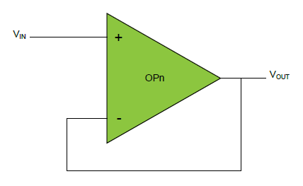

# Getting started with Mindi™ simulation and AVR®DB microcontrollers
This guide will get you up and running with simulating the analog OPAMP module in AVR DB family devices using the Mindi simulation tool.
## Configuration: voltage follower
Voltage follower is an op amp configuration in which the output voltage tracks the input voltage.  Also known as a unity gain amplifier.

### Mindi Simulation

Download and open the **Mindi schematic [here](schematics/Voltage_Follower.wxsch)**

Press the _play_ button to simulate with an example stimulus source.

### Tweaking
A voltage follower has no adjustable resistor values.

### Don't have Mindi?
Download and install [Mindi simulation tool](https://www.microchip.com/mplab/mplab-mindi)
